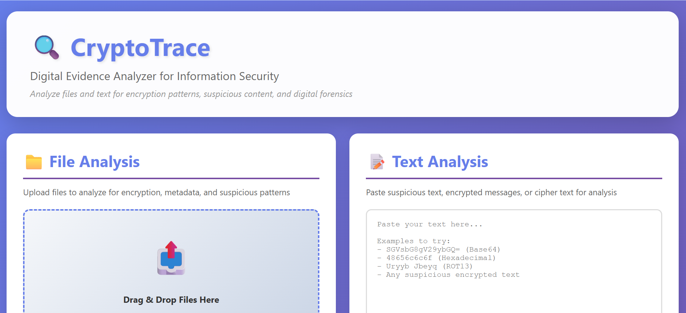
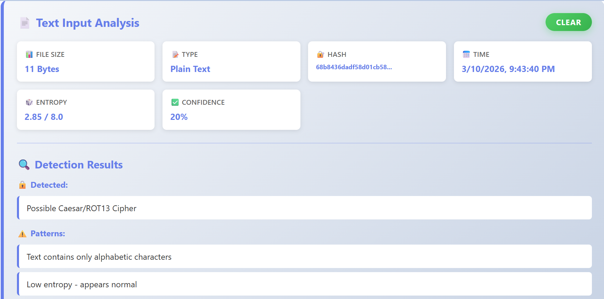
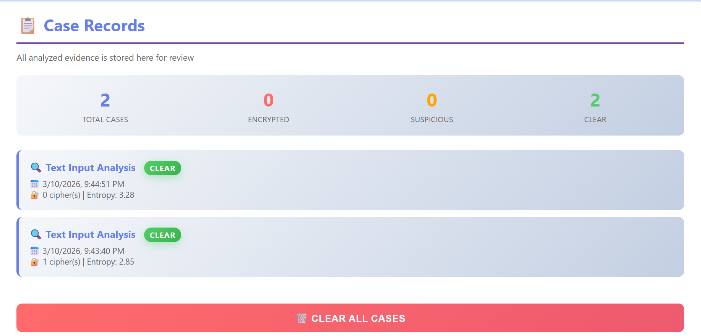

# 🔍 CryptoTrace - Digital Evidence Analyzer

**Automated encryption detection tool for digital forensics investigations**



## 🎯 Overview

CryptoTrace is a web-based forensic analysis tool that automates the detection of encrypted, encoded, and suspicious digital evidence. Using Shannon entropy analysis, cryptographic hashing, and pattern recognition, it identifies encryption schemes and provides actionable recommendations to investigators.

## ✨ Features

- 🔐 **Multi-Layer Encryption Detection**
  - Base64, Hexadecimal, ROT13 encoding detection
  - Shannon entropy analysis for AES/RSA indicators
  - File signature verification (magic numbers)

- 📊 **Statistical Analysis**
  - Entropy calculation (0-8 bits scale)
  - Confidence scoring algorithm
  - Pattern recognition and frequency analysis

- 🛡️ **Security Features**
  - SHA-256 cryptographic hashing for file integrity
  - Evidence chain of custody tracking
  - File type spoofing detection

- 💼 **Case Management**
  - Track all analyzed evidence
  - Statistical dashboard
  - Downloadable forensic reports

## 🚀 Quick Start

### Option 1: Direct Use (No Installation)
1. Download the repository
2. Open `index.html` in your browser
3. Start analyzing files!

### Option 2: Live Demo
🔗 [Try CryptoTrace Online](https://yourusername.github.io/CryptoTrace)

## 🎮 Usage

### Analyze Text
1. Paste suspicious text in the "Text Analysis" box
2. Click "Analyze Text"
3. View detection results with confidence scores

### Analyze Files
1. Drag and drop files into the upload zone
2. Automatic analysis begins
3. Review encryption indicators and recommendations

### Example Tests
```
Base64 Test: SGVsbG8gV29ybGQh
ROT13 Test: Uryyb Jbeyq
Hex Test: 48656c6c6f
```

## 🛠️ Technology Stack

- **Frontend**: HTML5, CSS3, JavaScript ES6
- **Security**: Web Crypto API (SHA-256)
- **Analysis**: Shannon Entropy, Regex Pattern Matching
- **File Handling**: FileReader API, ArrayBuffer Processing

## 📖 Core Algorithms

### Shannon Entropy Calculation
```javascript
H(X) = -Σ P(xi) × log₂ P(xi)

Thresholds:
- 0-3.5 bits: Normal text (Clear)
- 3.5-6.0 bits: Possible encoding (Suspicious)
- 6.0-8.0 bits: Likely encrypted (Encrypted)
```

### Confidence Scoring
```
Weighted Algorithm:
- Base64 Detection: +30%
- Hexadecimal Pattern: +25%
- ROT13/Caesar Cipher: +20%
- High Entropy (>7.5): +40%
- Encrypted File Extension: +35%

Classification:
- ≥60%: Encrypted 🔴
- 30-60%: Suspicious 🟠
- <30%: Clear 🟢
```

## 🧪 Detection Capabilities

| Encoding/Encryption | Detection Method | Auto-Decode |
|---------------------|------------------|-------------|
| Base64 | Regex pattern + padding | ✅ Yes |
| Hexadecimal | Character set validation | ✅ Yes |
| ROT13 | Alphabetic pattern | ✅ Yes |
| AES/RSA | Entropy > 7.5 | ❌ No (key required) |
| File Signatures | Magic numbers | ✅ Identifies type |

## 📸 Screenshots

### Main Interface


### Analysis Results


### Case Management


## 🔬 Information Security Concepts

This project implements:
- **Cryptographic Hashing** (SHA-256 - FIPS 180-4)
- **Information Theory** (Shannon Entropy)
- **Digital Forensics** (Evidence integrity)
- **Cryptanalysis** (Pattern recognition)
- **Malware Detection** (File signature analysis)

## 🎓 Educational Purpose

Created as part of Information Security coursework to demonstrate practical application of:
- Cryptographic principles
- Statistical analysis in security
- Digital forensics methodology
- Encryption detection techniques

## 📝 License

MIT License - See LICENSE file for details

## 👨‍💻 Author

**Your Name**
- GitHub: [@yourusername](https://github.com/yourusername)
- LinkedIn: [Your Profile](https://linkedin.com/in/yourprofile)
- Email: your.email@example.com

## 🙏 Acknowledgments

- Information Security Course - [Your College Name]
- Guided by: Dr. [Professor Name]
- Inspired by real-world digital forensics challenges

## 📚 References

- NIST FIPS 180-4: SHA-256 Specification
- Shannon, C.E. (1948): "A Mathematical Theory of Communication"
- NIST SP 800-22: Randomness Testing

---

**⭐ Star this repository if you found it useful!**
